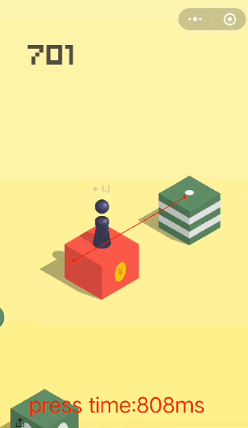

# 跳一跳辅助程序

## `MediaProjectionManager` 截图

## `'adb shell input swipe 320 410 320 410' + time` 跳

## sample.gif


## Server.js
```javascript
const http = require('http');
const { exec } = require('child_process');

var PORT = 8180;

var process = exec('adb shell')

http.createServer(function(req, res){
  res.writeHead(200, {'Content-type' : 'text/html'});
  res.write('<h1>Node.js</h1>');
  res.end('<p>Hello World</p>');
  var time = req.url.split('/')
  time=time[time.length-1]
  console.log('input swipe 320 410 320 410 ' + time);
  process.stdin.write('input swipe 320 410 320 410 ' + time + '\n')
}).listen(PORT);

```
